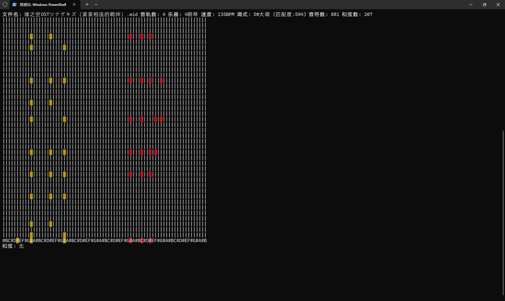

# MIDI Piano Roll Visualizer / MIDI 钢琴卷帘可视化播放器  

  

A Python-based MIDI player with piano roll visualization that displays falling notes in real-time, with chord detection and music theory analysis.  
一个基于 Python 的 MIDI 文件播放器，带有钢琴卷帘可视化效果，可实时显示音符下落，并具备和弦检测和乐理分析功能。

## Features / 功能特点  

- 🎵 Play standard MIDI files with tempo detection / 支持标准 MIDI 文件播放及速度检测  
- 🎹 Interactive piano keyboard visualization / 交互式钢琴键盘可视化  
- 🎼 Multi-track support with color coding / 多音轨彩色编码支持  
- 🎶 Real-time chord detection and display / 实时和弦检测与显示  
- 🎻 Automatic key/mode detection (major/minor) / 自动调式检测(大调/小调)  
- 📊 Music theory analysis (note count, chord count) / 乐理分析(音符数、和弦数统计)  
- 🎚️ Customizable keyboard layout (whole/half step spacing) / 可自定义键盘布局(全音/半音间隔)  

## Requirements / 系统要求  

- Python 3.6+  
- Terminal with ANSI color support / 支持 ANSI 颜色的终端  
- MIDI output device (optional) / MIDI 输出设备(可选)  

## Installation / 安装  

```bash
pip install mido colorama
```  

## Usage / 使用方法  

1. Run the program:  
```bash
python main.py
```  

2. Enter MIDI file path when prompted / 根据提示输入 MIDI 文件路径  

3. Select MIDI output device (optional) / 选择 MIDI 输出设备(可选)  

4. Enjoy the visualization! / 享受可视化效果!  

## Keyboard Controls / 键盘控制  

- `Ctrl+C` - Stop playback / 停止播放  

## Technical Highlights / 技术亮点  

- 🎼 Advanced chord detection algorithm supporting 40+ chord types / 支持40+种和弦类型的检测算法  
- 🎚️ Dynamic keyboard layout adjustment based on song range / 基于乐曲音域的动态键盘布局调整  
- 🎹 Real-time note highlighting with track colors / 按音轨颜色实时高亮音符  
- ⏱️ Precise tempo and timing handling / 精确的速度和时序处理  
- 🎵 Comprehensive MIDI meta information display / 完整的 MIDI 元信息显示  

## License / 许可证  

```text
GNU GENERAL PUBLIC LICENSE
Version 3, 29 June 2007

Copyright (C) 2023 [Your Name]

This program is free software: you can redistribute it and/or modify
it under the terms of the GNU General Public License as published by
the Free Software Foundation, either version 3 of the License, or
(at your option) any later version.

This program is distributed in the hope that it will be useful,
but WITHOUT ANY WARRANTY; without even the implied warranty of
MERCHANTABILITY or FITNESS FOR A PARTICULAR PURPOSE.  See the
GNU General Public License for more details.

You should have received a copy of the GNU General Public License
along with this program.  If not, see <https://www.gnu.org/licenses/>.
```

## Known Limitations / 已知限制  

- Complex MIDI files may experience minor timing drift / 复杂 MIDI 文件可能出现轻微时序漂移  
- Some terminal emulators may have display artifacts / 部分终端模拟器可能出现显示异常  
- Maximum polyphony not enforced / 未限制最大复音数  

## Contributing / 贡献指南  

Pull requests are welcome! Please ensure your changes:  
欢迎提交 Pull Request! 请确保您的修改:  

1. Maintain backward compatibility / 保持向后兼容性  
2. Include appropriate tests / 包含适当的测试  
3. Document new features / 为新功能添加文档  

For major changes, please open an issue first to discuss.  
重大修改请先创建 issue 进行讨论。
